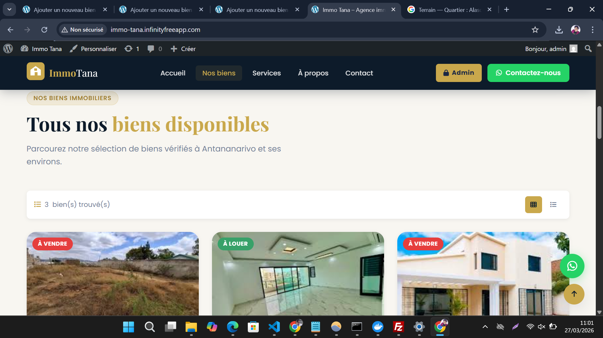
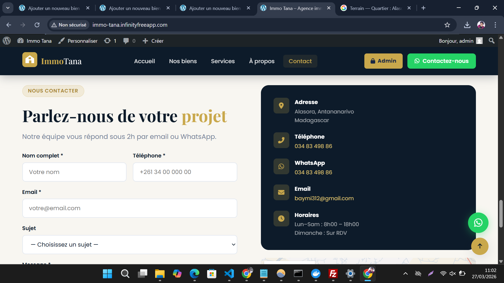
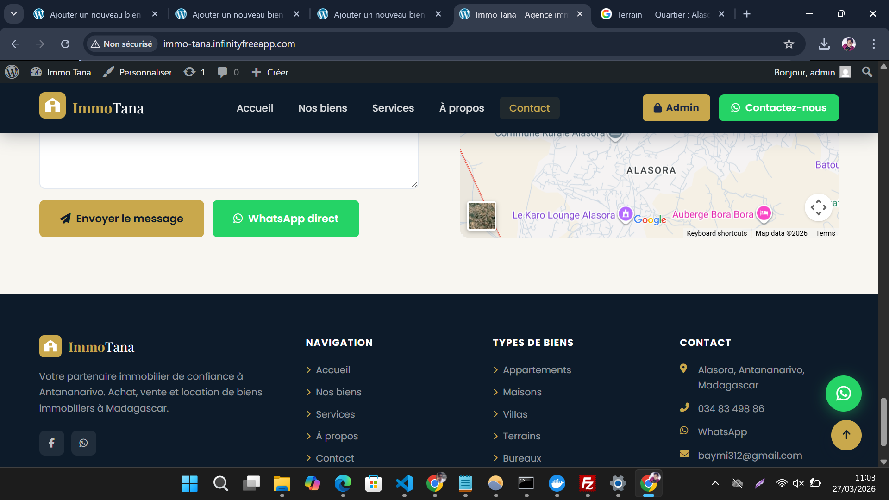
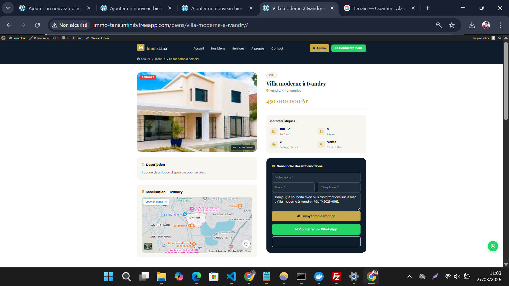
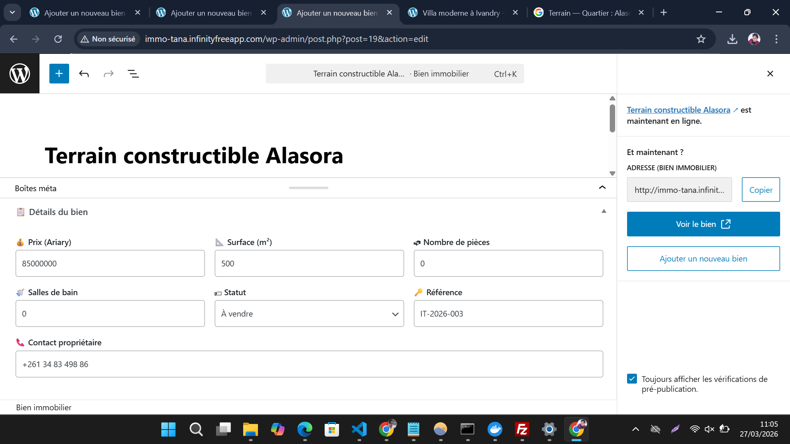
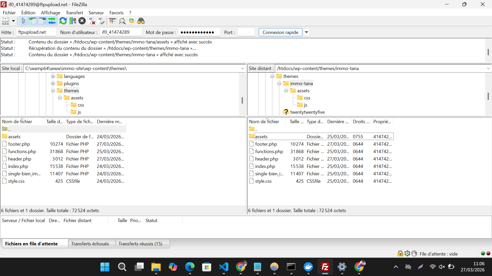
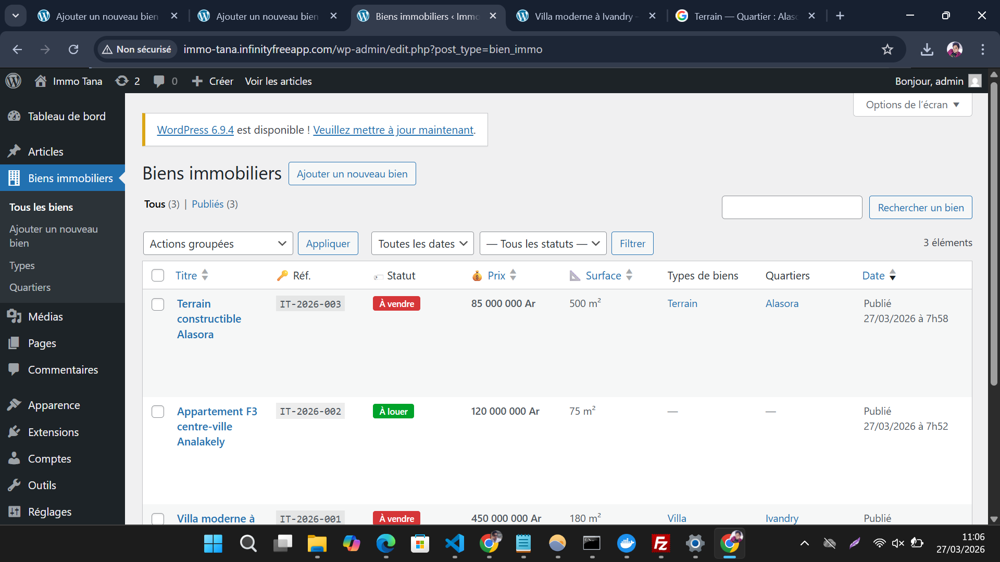

# 🏠 Immo Tana — Thème WordPress Immobilier Custom


> Thème WordPress immobilier **100% custom** (sans page builder) — listings dynamiques, CRUD backend complet, AJAX filter, WhatsApp, email contact.

**🌐 Live Demo :** [immo-tana.infinityfreeapp.com](http://immo-tana.infinityfreeapp.com)

---

## 📸 Screenshots

| | |
|---|---|
|  |  |
| *01 — Page Accueil (Hero + stats)* | *02 — Section Nos biens* |
|  |  |
| *03 — Services* | *04 — À propos* |
|  |  |
| *05 — Formulaire contact* | *06 — Footer + carte* |
|  |  |
| *07 — Page détail bien* | *08 — Ajout bien (CRUD admin)* |
|  |  |
| *09 — Déploiement FTP InfinityFree* | *10 — Liste biens admin (CRUD)* |

---

## 🔐 Accès Recruteur (Demo)

| Rôle | URL | Identifiant | Mot de passe |
|------|-----|-------------|--------------|
| **Admin WP** | [/wp-admin](http://immo-tana.infinityfreeapp.com/wp-admin) | `admin` | `admin123` |
| **Frontend** | [immo-tana.infinityfreeapp.com](http://immo-tana.infinityfreeapp.com) | — | — |

> ⚠️ Compte demo — lecture seule recommandée. Ne pas supprimer les biens existants.

---

## 📋 Tester les fonctionnalités

### 1. CRUD Backend (Admin WordPress)
1. Connectez-vous sur `/wp-admin` avec les identifiants ci-dessus
2. Cliquez **"Biens immobiliers"** dans le menu gauche
3. Vous verrez : colonnes personnalisées (Prix, Surface, Statut, Référence)
4. Utilisez les filtres : **"Type de bien"** / **"Statut"** (vente/location)
5. Cliquez **"Ajouter un bien"** → remplissez les meta boxes (prix, surface, pièces, bains, statut, référence)
6. Ajoutez les taxonomies : **Type de bien** (Villa/Appartement/Maison) + **Quartier** (Ivandry/Analakely...)
7. Publiez → vérifiez que le bien apparaît sur le frontend

### 2. AJAX Filter (Frontend)
1. Allez sur [immo-tana.infinityfreeapp.com](http://immo-tana.infinityfreeapp.com)
2. Scrollez vers la section **"Nos biens"**
3. Utilisez la barre de recherche / filtres : Type, Quartier, Statut
4. Les résultats se chargent **sans rechargement de page** (AJAX + WP_Query)

### 3. Formulaire Contact
1. Remplissez le formulaire en bas de page (footer) :
   - **Nom** : Jean Dupont
   - **Email** : test@example.com
   - **Téléphone** : +261 34 00 000 00
   - **Message** : Bonjour, je suis intéressé par vos biens à Ivandry.
2. Cliquez **"Envoyer"**
3. Le message est sauvegardé en DB (Articles → privés dans l'admin)

### 4. WhatsApp Integration
- Cliquez le bouton **vert WhatsApp** (coin bas-droit)
- Ouvre directement une conversation WhatsApp avec l'agence

### 5. Page bien individuelle
- Cliquez sur n'importe quel bien → page détail avec :
  - Galerie + caractéristiques complètes
  - Formulaire de contact pré-rempli (titre du bien)
  - Biens similaires en bas de page

---

## 🔧 Fonctionnalités Techniques

### Architecture
```
immo-tana/
├── functions.php          # OOP — classe ImmoTana_Theme
├── index.php              # Page principale (hero, biens, services, à propos)
├── single-bien_immo.php   # Template bien individuel
├── header.php             # Logo SVG custom + navigation responsive
├── footer.php             # Contact + Google Maps + WhatsApp float
├── style.css              # Theme header WordPress
└── assets/
    ├── css/main.css       # Design complet (Navy + Gold)
    └── js/main.js         # AJAX filter + animations + contact form
```

### Custom Post Type — `bien_immo`
```php
// Enregistrement CPT
register_post_type('bien_immo', [
    'labels'      => [...],
    'public'      => true,
    'has_archive' => true,
    'supports'    => ['title', 'editor', 'thumbnail'],
    'menu_icon'   => 'dashicons-building',
]);
```

### Taxonomies personnalisées
- **`type_bien`** : Villa, Appartement, Maison, Studio, Bureau, Terrain
- **`quartier`** : Ivandry, Analakely, Ambohimanarina, Antanimena, Ankadifotsy, Alasora

### Meta Boxes (CRUD)
| Champ | Type | Description |
|-------|------|-------------|
| Prix | number | Prix en Ariary |
| Surface | number | Surface en m² |
| Pièces | number | Nombre de pièces |
| Salle(s) de bain | number | Nombre de bains |
| Statut | select | vente / location |
| Référence | text | Code unique (REF-001...) |
| Contact vendeur | text | Téléphone WhatsApp |

### Admin Colonnes + Filtres
```php
// Colonnes personnalisées dans la liste des biens
add_filter('manage_bien_immo_posts_columns', [$this, 'admin_columns']);
// Filtres par statut et type dans la barre admin
add_action('restrict_manage_posts', [$this, 'admin_filters']);
```

### AJAX Filter (WP_Query)
```javascript
// Frontend — envoi filtre AJAX
$.ajax({
    url: immo_ajax.url,
    type: 'POST',
    data: { action: 'immo_filter', nonce: immo_ajax.nonce, type, quartier, statut }
});
```
```php
// Backend — WP_Query avec tax_query + meta_query
$query = new WP_Query([
    'post_type'  => 'bien_immo',
    'tax_query'  => [['taxonomy' => 'type_bien', 'terms' => $type]],
    'meta_query' => [['key' => '_immo_statut', 'value' => $statut]],
]);
```

### Contact Form → Database + Email
```php
// Sauvegarde en DB (wp_insert_post) + envoi email (wp_mail)
public function ajax_contact() {
    check_ajax_referer('immo_filter_nonce', 'nonce');
    $post_id = wp_insert_post([...]);  // Sauvegarde en DB
    wp_mail($to, $subject, $body);     // Email
    wp_send_json_success([...]);
}
```

---

## 🎨 Design

- **Palette** : Navy `#1a2744` + Gold `#c9a96e` + White
- **Typographie** : Playfair Display (titres) + Inter (corps)
- **Responsive** : Mobile-first, breakpoints 768px / 1200px
- **Animations** : Intersection Observer API (scroll animations)
- **Compteurs** : Counter animation sur les stats (hero section)

---

## 🛠️ Stack Technique

| Technologie | Usage |
|-------------|-------|
| **PHP 8.2** | Backend, OOP, hooks WordPress |
| **WordPress 6.9** | CMS, CPT, taxonomies, WP_Query |
| **MySQL** | Base de données |
| **JavaScript ES6** | AJAX, DOM, animations |
| **CSS3** | Grid, Flexbox, custom properties |
| **WP Mail SMTP** | Configuration SMTP Gmail |

---

## 🚀 Installation Locale

```bash
# 1. Cloner dans le dossier themes WordPress
git clone https://github.com/Bayane-max219/immo-tana wp-content/themes/immo-tana

# 2. Activer le thème dans WP Admin → Apparence → Thèmes

# 3. Créer quelques biens via : Admin → Biens immobiliers → Ajouter
```

**Prérequis :** WordPress 6.x, PHP 8.x, MySQL 5.7+

---

## 📧 Contact

**Bayane** — Développeur WordPress Full-Stack
📧 baymi312@gmail.com
💼 [Portfolio](https://github.com/Bayane-max219)

---

*Projet réalisé dans le cadre d'un portfolio WordPress professionnel — thème 100% custom, sans page builder.*
